# Loadline : Stress & Workload Manager by Team W10

**Team:** Lei Wing Teng, Ang Li Jia, Dennis Heng Shu Yi<br>
**Problem Statement:** Stress & Workload Manager<br>
**Video Presentation:** [Unlisted YouTube link]<br>
**Presentation Slides:** [Public link]

---

## 1. Project Overview

### The Problem

A student does not burn out because one week was heavy. They burn out because **recovery gets
less effective the more depleted they are** — and that is the one thing no tracker shows them.

**Causes, as we understand them.**

- **Load arrives from everywhere and lands nowhere.** A timetable is in a PDF, assignment
  deadlines are in a course outline, a part-time shift roster arrives as a photo in a group
  chat, and "mum's birthday Sunday" lives only in the student's head. Nothing holds all of it,
  so nobody can see the total.
- **The pile-up is non-linear, but every tool is linear.** Eight hours booked in a good week
  and eight hours booked in a bad week are not the same eight hours. At a healthy reserve you
  get roughly all of your rest back; badly depleted, you get about half. So a fortnight looks
  survivable right up until it isn't, and by the time it obviously isn't, the cheap
  interventions are gone.
- **Rest is the first thing cut, because it is the only thing with no deadline.** Everything
  else on the calendar has someone else attached to it.
- **The failure mode is not always overload.** A student at 60% capacity can be completely
  stuck on one task, and paralysis produces stress without producing progress.

**Stakeholders.** University students first (our design case is a Malaysian undergraduate at
UTC+8, often with a part-time job). Around them: friends and housemates who notice before the
student does, lecturers who receive the 2 a.m. extension request, and campus counselling
services who see people only after the crash.

**What exists, and why it falls short.**

| Existing tool | What it does well | Why it does not solve this |
|---|---|---|
| **Google Calendar** | Authoritative record of what you agreed to | It will happily show a 14-hour day in the same font as a 2-hour day. It has no model of capacity, so it can never tell you a week is unsurvivable. |
| **Motion / Reclaim.ai** (auto-scheduling) | Genuinely solve *fitting things in* | They optimise for tasks completed and treat you as a constant-throughput resource. Rest is the slack they fill. They cannot say "you shouldn't do this at all." |
| **Finch / Headspace** (wellbeing apps) | Low-friction habit and mood tracking | They sit next to your workload and never touch it. A streak you broke during finals week is one more thing you are failing at. |
| **Todoist / TickTick** | Excellent capture | Manual entry is the main reason students abandon planners, and a to-do list has no opinion about whether the list is possible. |

The gap is the same in all four: **they track and report. None of them forecasts, and none of
them models that a depleted person recovers worse.**

### Our Solution

This is a stress and workload manager built around a small simulation of the student rather
than a list. It runs four coupled reserves — mental, physical, social and errands — forward
over a 21-day horizon, and the load-bearing term is that **recovery is multiplied by an
efficiency that falls with the reserve**, so the spiral becomes visible in the projection days
before it is visible in the student's life. Everything on screen is a view of that projection: a
room that fills up with what the fortnight is asking of them, a dial saying how much reserve is
left, and — when a week is in trouble — *one* concrete action rather than a dashboard.

The other half of the design is that getting data in must cost almost nothing: photograph a
timetable or an assignment brief, type an unpunctuated brain dump, forward a roster to a
Telegram bot, or connect Google Calendar. **Nothing is ever imported silently** — everything
parsed comes back as chips to confirm.

**Feature set**

*The model underneath — why this forecasts instead of tracking*
- **We compute a reserve for every future day, not a score for today.** The engine simulates
  the student forward one day at a time across a 21-day horizon, carrying four reserves from
  each day into the next: yesterday's reserve, minus what today drains, plus what tonight's
  sleep and rest repay. That produces a number for every reserve on every day ahead — which is
  what lets the app say *when* a week breaks rather than only that it is heavy, and name the
  **deficit crossing**: the first day the floor drops below 30. It is a projection, so it is
  quoted as a **band** rather than a line — the same fortnight run three times at estimate
  biases of 0.95×, 1.15× and 1.4×. **And the band widens when the student goes quiet.** Each
  consecutive missed check-in inflates the estimate, because non-check-in correlates with bad
  weeks: a model that gets more worried when someone stops answering is behaving correctly,
  and one that treats silence as neutral turns optimistic right before the crash. Answering
  once clears the run — the model forgives rather than holding a grudge.
- **The efficiency curve: why burnout spirals.** Rest is not worth a fixed amount. It is
  multiplied by an efficiency that falls with the reserve — at full reserve you get all of a
  rest block back, at 20% reserve you get 56% of it. So depletion makes the cure weaker at
  exactly the point you need it most, and the curve turns a manageable week into an
  unrecoverable one without any single day looking alarming. This is the feature. Every screen
  is a way of seeing it early enough to act.
- **Carryover: what you just did changes what comes next.** A task's cost is a property of the
  task *and* the state you arrive in. Every finished activity leaves a residue on the reserves
  it was not even about, decaying over the hours after it — hard exercise takes roughly a
  quarter off your mental capacity for the next few hours, a long study block takes more, and a
  short walk *adds* about a tenth. Sleep is the one full reset. So two identical days in
  different orders are not equally survivable, and the solver cannot stack gym at 5 and deep
  study at 7 and call it a good day.

*See everything in one glance*
- **The room** — ceiling weights, paper stack, floor clutter, plant, bed, window weather, light
  level and a door, each bound to a real model quantity. Tap any object for the numbers behind it.
- **The capacity dial** — reserve remaining, with five domain bars each against *its own*
  ceiling and a trend glyph, so severity is never carried by colour alone.
- **Low social load is flagged as a warning, not as "good"** — a tracker that sums hours would
  call an isolated student healthy.
- **The AI insight on the gauge page** — tap through to the reserves sheet and, under the four
  bars, the app says the part a bar cannot draw. For each reserve below 70 it names **what an
  hour of rest is actually worth there right now** — the efficiency curve read at that student's
  own level, which is the mechanic the whole app exists to show and the one thing a percentage
  cannot express. Then, for the reserve that is lowest — because burnout is a floor problem, so
  exactly one reserve is the one that matters — it names the **deficit**: which day it arrives,
  the two biggest things that actually paid for it in the student's own words, how many short
  nights contributed, and what is already on the calendar that would restore it. The language
  model writes the sentence; every number and every claim in it comes from the engine.
- **The fortnight you actually lived, beside the one being planned.** A sparkline of reported
  energy over the last 21 days — the same span as the horizon, so the two surfaces answer the same
  question from opposite ends. It reports and does not model, and it refuses to draw below three
  points: two dots joined by a line assert a direction nobody measured.
- **Low-energy mode** — below a reserve threshold the interface collapses to one number and one
  action.

*Balance the load*
- **Auto-Rebalancer** — a real solver (hill-climbing, best neighbour to convergence) maximising
  the *minimum* reserve across the fortnight under hard constraints. Client-side, no backend call,
  and deterministic: the same week and seed always give the same answer.
- **Smallest-fix search** — the single move with the biggest effect, because a student will do
  one thing and will not follow a nine-change reshuffle.
- **Later — defer one thing, to the *kindest* day that will take it.** The obvious
  implementation is the wrong one: pushing a block to the next day with a free gap drops four
  hours of study onto the worst day of the fortnight without noticing, so the student then has
  to run Rebalance to undo what Later just did — two buttons on one screen fighting each other.
  Instead every day with room is scored with the rebalancer's *own* objective, so no second set
  of weights exists to drift out of step. It is bounded twice: **never past the item's deadline**
  (deferring must not be a way to make a deadline quietly disappear) and never off the end of the
  horizon (an item pushed past day 21 vanishes from the model while still existing in the
  student's life). It also reports **how many days with room it passed over**, because a student
  who watches Later skip a visibly empty Wednesday cannot otherwise tell a decision from a bug —
  and it prices the move on the block's own reserve, since the search picks the best day to move
  to, which can still be worse than not moving at all.
- **Request box** — paste an incoming ask, get its price *in what gets given up* ("two gym
  sessions and one evening out"), plus a drafted reply in three tones. The app never sends it.
- **Reality Check — you overestimate yourself, and that is what breaks the plan.** A timetable
  the student cannot actually keep is worse than no timetable: the work does not shrink, it
  slides into the next day and the day after, and the resulting guilt is load of its own. So
  every completed block records planned hours against actual hours, and the app learns the ratio
  per kind of work *and* per family of task — it can say your essays run 1.8× over while your
  lab reports land on time. That correction is applied to the plan, so what the app
  proposes is a week you can follow rather than one you would like to be able to follow. It only
  ever pads *upward*: finishing early is deliberately not a reason to shrink an estimate, because
  padding downward would quietly make a heavy week look survivable.
- **The week that is not badly arranged, just too big.** Everything above is a rearrangement —
  move the lab report, batch the errands, take a rest — which is the right answer for somebody
  merely badly scheduled. This is the case where it is not: the work does not fit in the days
  available and no amount of moving it will make it fit. So the rebalancer is run here *purely in
  order to be disbelieved* — if the solver's own best attempt clears the deficit, the app says
  nothing at all, because telling a student to delete work they could have kept is the app giving
  up on their behalf. When it genuinely does not fit, the card names the day and what is standing
  on it, and stops there. It deliberately does **not** rank which commitment matters least: there
  is no field anywhere in a block for importance, and inventing one out of hours and load type
  would be exactly the confidently wrong number this project holds to be worse than an admitted
  gap. The student decides what comes out.
- **Four bad days in a row is not a scheduling problem.** When reported energy sits at or below
  the check-in's "Low" band for four consecutive days, the app stops offering to move blocks
  around. Four rather than two, in both directions deliberately: fewer and it fires on the bad
  week everybody has, and a message this heavy arriving every few weeks is one a student learns
  to dismiss — more and the app spends a fortnight suggesting errand batching at somebody who
  needs something else entirely.

*Plan properly, and get it all in without typing*
- **Say-anything planner** — unstructured thoughts in, a structured, editable week out.
- **Photo import** — timetable, assignment brief, shift roster, or a photographed notebook page.
- **Weekly repeats, and nothing richer than that.** A class, a lab and a shift meet weekly or not
  at all, so recurrence is a set of weekdays and an end date for semester break — nothing monthly,
  nothing fortnightly, no rule language. Anything more expressive is a setup burden, which is the
  cost this design cuts everywhere else.
- **A clash is a warning, never a refusal.** A student entering two things at the same hour has
  usually made a real mistake and is told so. But an app that *refuses* the entry is wrong about
  its own subject: somebody recording that a lecture was cancelled, or that two things genuinely
  do collide this week, is recording their life, and the fortnight the app would then hold is a
  fiction every forecast is computed from. The double-booking is often precisely the signal they
  came to show it.
- **Google Calendar, both directions** — OAuth import of what is already agreed to, and push back
  so a rebalanced week and its protected rest land in the calendar the student (and everyone
  around them) actually looks at. A supplement, never the only door: most Malaysian students do
  not keep their timetable there, and depending on it risks an empty week and a hollow first
  impression.
- **Telegram as a second door** — the roster photo, the voice-note brain dump and the "did the 7pm
  block happen?" answer all arrive where the student already is, instead of depending on them
  remembering to open an app. Paired with calendar push, the loop closes without the app ever
  being opened: load arrives by chat, the plan leaves by calendar.

*Start without paralysis*
- **Micro-Start, built for task paralysis specifically.** This is the failure mode in the brief
  that is *not* caused by carrying too much — a student at 60% capacity can be completely stuck
  on one task — and it is the one students with ADHD describe most often. The design follows from
  that rather than from a generic "break it into steps": a chain of concrete sub-ten-minute
  actions revealed **one at a time**, on every block without exception, because a stuck person
  cannot choose from a menu and a wall of unticked boxes reads as proof of how much is left. It
  is offered manually with no explanation asked for, and automatically when a task goes stale.
  (A design stance, not a clinical claim — we have not tested this with a clinical population.)
- **Paralysis is visible in the model, not just in the UI.** A stuck task accrues mental drain
  without accruing progress, so rising mental load against flat completion is itself a detectable
  signal — which is what lets Micro-Start be offered before the student has to ask.

*Take breaks before burnout*
- **Protected rest** is a scheduled object with weight that the optimizer is forbidden to move.
- **Undated things get a deadline anyway, or they always lose.** Health, relationships and rest
  have no due date, and the codebase said so in three separate places: deadline pressure skipped
  every item without one, the constraint checker defended only dated work, and Later clamped
  undated work to the horizon edge and nothing sooner. Between them a walk could be put off
  forever, for free. So every event gets a deadline — real where one exists, synthetic where none
  does — and the two compete on the same terms. "The same terms" means scheduling priority and
  only that: a synthetic deadline is deliberately kept out of the anticipatory-stress drain, since
  inventing dread about a walk you scheduled is not a claim the model can support.
- **Prescriptions matched to the depleted reserve**, sized to the real gap, one option only.
- **The Rest button** — one control for a student who is flat right now. It tries three rungs in
  order and stops at the first that works: *it already fits* (there is a gap today), *one thing
  would have to move* (and it is named, with the move shown), or *refused, and here is why* —
  no room today, or you have already had the rest that is worth having. There is deliberately
  **no "how about Thursday?"** answer: someone tired now is not asking for a plan, and offering
  one answers a question they did not ask. Nothing is applied automatically; the button computes
  an offer and the student accepts it.
- **The recovery receipt** — the reserve on the day the rest lands, before and after, plus the
  fortnight's floor and whether the deficit crossing moved. Rest feels unproductive because its
  effect is invisible; this is the number that makes it visible.
- **The sleep page** — states a target, reports actual nights, and warns when an over-committed
  day is about to cost the night after it.

*What the second door may and may not do*
- **The Telegram bot is a second door onto existing behaviour, never a second product.** Twelve
  commands, each one a flow the app already has: post-block confirmation and the retroactive
  "yesterday went to plan, correct?" fill (`/today`, `/yesterday`), the daily check-in in two taps
  rather than a screen (`/checkin`), the fortnight at a glance and any single day of it (`/week`,
  `/schedule`, `/day 4`), Rest (`/rest`), Micro-Start (`/stuck`), request pricing (`/ask`), lapsed
  commitments with their withdrawal text (`/lapsed`), and Rebalance (`/rebalance`) — which computes
  the same solve the app does and refuses to apply it if the week changed underneath, by comparing
  a fingerprint. A plain message is a brain dump, because that is the commonest thing a student
  sends and it must not need ceremony; voice notes and forwarded photos arrive the same way. The
  one thing chat does that the app cannot is *reach* the student: `api/daily.ts` runs on a Vercel
  cron and messages only on the two transitions that change the answer to "does my fortnight hold"
  — it held and now it does not, and the reverse. A bot that messages daily is one a student mutes
  within a week. It may never commit anything unconfirmed, never decline or send a message on the
  student's behalf, never treat a chat id as an identity — linking goes through a short-lived code
  shown in the app — and never scold a missed block. The app stays fully usable with the bot
  switched off.

---

## 2. Ideation & Process

### 2.1 Ideas We Considered

Chosen ideas first. The "why" column is the reasoning as it was actually recorded — the
specification carries inline amendments where building something proved an idea wrong, and
`docs/rulings.md` indexes the decisions the source code cites by number.

| Idea | Why it was kept / dropped |
|---|---|
| **Four coupled reserves with a falling recovery efficiency** *(Chosen)* | The whole thesis. A linear tracker cannot represent "recovery works worse when you are depleted," which is the phenomenon the brief describes. It also gives every screen one honest source of truth. |
| **The room as the home screen** *(Chosen)* | Composition and total, read without reading. Kept with a hard scope guard: one room, nine bindings, one tidy-up animation — no room editor, no unlocks. That is a different product and it would eat the weekend. |
| **Keeping the capacity dial *alongside* the room** *(Chosen)* | We stopped treating this as room-or-dial. The dial is precise and de-risks the whole "see it" promise in about two hours; the room gives the instinct. The dial was built first deliberately, so that if the room failed we still had a complete answer. |
| **Solver, not shuffle — maximise the minimum reserve** *(Chosen)* | Burnout is a floor problem. A fortnight that averages fine and bottoms out at 8 is still a crash, so the objective reads the floor and every other term is a tiebreaker that can never outrank it. |
| **Say-anything planner** *(Chosen)* | Manual task entry is the single largest reason students abandon planners. Without this the rest of the app is worthless, because nobody enters anything. |
| **Photo-of-anything import** *(Chosen)* | Widened from "timetable OCR" once we accepted that a vision model does the identification: a notebook page, a whiteboard photo, a Post-it all cost nothing extra to accept, and plenty of students plan on paper. |
| **Micro-Start** *(Chosen)* | The one failure mode in the brief not caused by carrying too much. Cheap to build, and it is the beat that lands in a demo. |
| **Protected rest as a scheduled object with weight** *(Chosen)* | The most important design decision in the app: it makes recovery structurally defended rather than a notification you swipe away. |
| **Declining, as a tool inside load balancing** *(Chosen, demoted)* | An earlier version made refusal the entire thesis. Demoted after team discussion, because students mostly already know they are buried; the mechanics (pricing, drafted declines, provisional yes with auto-expiry) survived intact as a feature. |
| **Telegram bot as a second door** *(Chosen)* | The highest-value input path depends on the least reliable delivery — a student remembering to open an app. Chat is where the roster photo already is. Constrained so it can never commit or send anything unconfirmed. |
| **Publishing a 48-hour prediction error** *(Chosen)* | The 21-day projection is unfalsifiable by construction: if it warns you and you act, you never learn whether it was right. So we narrowed the claim to one that resolves within 48 hours regardless of what the student does, and we score that. |
| **Burnout *simulator*, visibility as the headline** | Dropped as a framing. "Here is how bad it is" is a diagnosis, not a manager — it stops one step before the student can do anything about it. |
| **Refusal engine as the thesis** | Dropped: it assumes the student's problem is not knowing how to say no, when the more common problem is not seeing the shape of the fortnight at all. |
| **A dial reading 0–120% "capacity"** | Dropped on contact with the engine. The engine produces a *reserve*, clamped to 100, so an overload needle was unreachable code — and delivering "you're at 100% capacity" over a reserve number told a perfectly rested student the opposite of the truth. |
| **Calibration mode picker (four taps, sets every prior)** | Cut deliberately. It asked every student a question that nothing downstream actually read; the optimizer now infers the mode instead. |
| **Three-day painter and parameter extraction** | Dropped on time. It was the planned way to measure where sleep *starts* paying back; that parameter is still unmeasured, and the specification was amended to say so rather than quietly promising it. |
| **Two-axis post-block rating (completion × difficulty)** | Reduced to a single four-way question about duration. The second axis had no consumer, because the learned cross-effect matrix it would feed is roadmap-only. |
| **Learned per-user cross-effect matrix** | Roadmap. It needs weeks of ratings, and faking learning in a weekend demo would be dishonest. The priors are hardcoded and presented as priors. |
| **Native app (Capacitor) for real sensors and a true widget** | Dropped for this build. Sleep, steps and screen time already sit in the phone and we lose them by going web — but a PWA installs from a URL during judging with no store, no signing and no cable. Named as the migration path rather than pretended away. |
| **Messaging-app share target for the request box** | Dropped: Android-only for PWAs, unsupported on iOS, and awkward to demo from a laptop. Paste and voice cover it. |
| **Live maps call for "get outside"** | Dropped in favour of a curated list — instant, and it cannot fail on stage. |
| **Malaysia holiday and festival table, prayer-time blocks, state-level variation** | Not built. The one consequence that did ship is the timezone: the student's own day, never the server's, which at UTC+8 is the difference between naming today and naming yesterday. |
| **Social features — status broadcast, hangout matching, routing a nudge through a friend** | Roadmap. All three need a second real user to be worth anything, and a hackathon demo has one. |
| **A separate backend host** | Rejected as an upgrade that would actually be a mistake. The expensive work (engine and optimizer) is pure client-side arithmetic; what remains is four short request/response jobs a serverless function does well. |

### 2.2 Ideation Boards

Three boards, in the order we drew them: what the problem actually is, everything the idea could
become, and what the thing does when a student touches it.

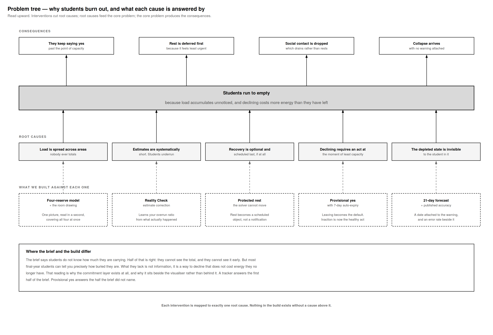

**Problem tree — why students burn out, and what each cause is answered by.** Read upward:
interventions cut root causes, root causes feed the core problem, the core problem produces the
consequences. The rule we held ourselves to is along the bottom — *each intervention maps to
exactly one root cause, and nothing in the build exists without a cause above it.* The core is
"students run to empty, because load accumulates unnoticed and declining costs more energy than
they have left," and the five root causes under it are each answered by one thing we built: the
four-reserve model against invisible total load, **Reality Check against systematically short
estimates**, protected rest against recovery being optional, provisional yes against declining
requiring an act at the moment of least capacity, and the 21-day forecast against the depleted
state being invisible to the student in it. The box at the bottom is where we argued with the
brief: the brief says students do not know how much they are carrying, and we think that is only
half right — most final-year students can tell you precisely how buried they are. What they lack
is not information, it is a way to decline that does not cost energy they no longer have.

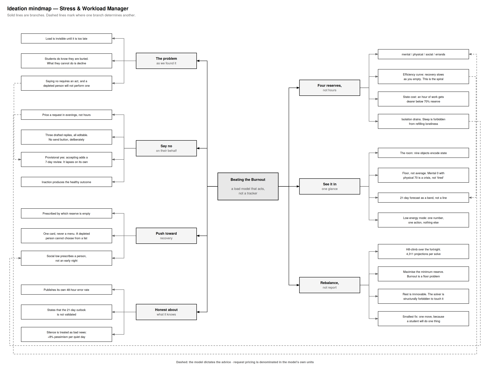

**Mindmap — everything the idea could be, organised around one centre.** The centre is the
sentence we kept returning to: *a load model that acts, not a tracker.* Five branches come off it
— the problem as we found it, saying no, seeing it in one glance, rebalancing rather than
reporting, and being honest about what the model knows. The dashed lines are the part worth
looking at: they mark where one branch **determines** another rather than merely sitting beside
it. "Isolation drains, and sleep is forbidden from refilling loneliness" reaches across to "social
low prescribes a person, not an early night"; the 21-day band reaches across to how a request is
priced. That is the test we used to decide whether a feature was ours or borrowed — if it did not
hang off the model, it was a planner feature and somebody else was already building it.

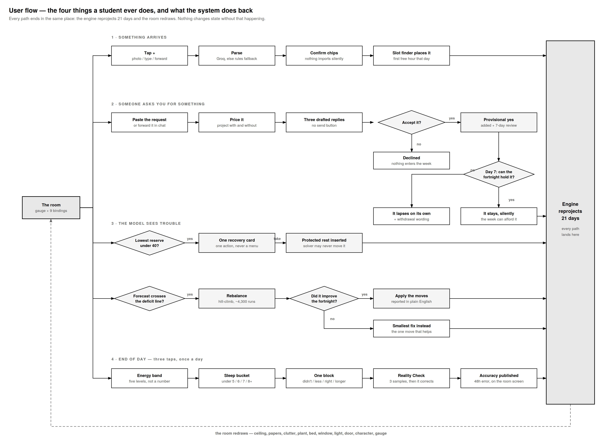

**User flow — the four things a student ever does, and what the system does back.** Everything a
student can do collapses into four paths: something arrives, someone asks you for something, the
model sees trouble, and the end-of-day check-in. Drawing it this way is what enforced the
three-tap rule, and it exposed the two decision diamonds that carry most of the product's
character — *accept it?* (which leads to a provisional yes with a day-7 review that lapses on its
own) and *did rebalancing actually improve the fortnight?* (which falls back to the smallest
single fix when it did not). Note where every path ends: **the engine reprojects 21 days and the
room redraws.** Nothing in this app changes state without that happening, which is why there is
only ever one version of the truth on screen.

The reasoning that survived into the code is also recorded in two living documents, which are the
honest version of an ideation board for a build this size:

- **[`burnout-app-spec-v3.md`](burnout-app-spec-v3.md)** — the specification, carrying inline
  amendments where building something proved the idea wrong.
- **[`docs/rulings.md`](docs/rulings.md)** — the decisions taken mid-build that the source code
  cites by number.

### 2.3 Mentor Consultation

| Date | Mentor | Feedback Received | What Was Changed |
|---|---|---|---|
| 2026-09-11 | [Mentor name] | The direction is stronger than the other teams', who are mostly building planners and are not actually addressing burnout. Advice: lean as hard as possible into burnout *prevention* specifically. | Taken as the organising principle for the whole README rather than a tweak. The feature list now opens with the model — the forecast, the efficiency curve, carryover — before any screen is described, so the first thing a reader meets is the burnout mechanic rather than another task list. The comparison table in §1 was sharpened to say exactly this: every tool named tracks and reports, none of them forecasts. |
| 2026-09-11 | [Mentor name] | She expected at least one team to bring a genuine prediction model, and nobody has. | Foregrounded rather than assumed. "We compute a reserve for every future day" is now the first bullet of the feature set, and "it forecasts, every comparable tool reports" is item 2 in §4. §5 gained a full engine walkthrough with the actual equations and coefficients, so the model can be checked rather than taken on trust. |
| 2026-09-11 | [Mentor name] | Called it novel that the model learns from what the student actually did — if it schedules 2 hours for an assignment and the student takes 10, it should learn from that. | This existed as Reality Check but was buried in one line. It is now a headline: a full feature bullet, and item 3 in §4. We also made the framing honest about direction — the correction is about the student overestimating what they can get through, which is what makes a planned timetable unfollowable, and it only ever pads *upward*. |
| 2026-09-11 | [Mentor name] | On hearing that Micro-Start was designed for task paralysis and ADHD students: that angle is very different from what other teams have, and worth leaning into as a niche. | Micro-Start's feature entry was rewritten to lead with task paralysis rather than describing generic step-splitting, and to say why the one-rung-at-a-time design follows from it. We also surfaced that paralysis is detectable in the model itself — rising mental drain against flat completion — so the app can offer it before being asked. Stated as a design stance, not a clinical claim, since we have not tested with a clinical population. |

## 3. Design & Prototype

**UI Prototype:** [Public link — check that it opens in an incognito window]

> Replace with real screenshots from the deployed app.

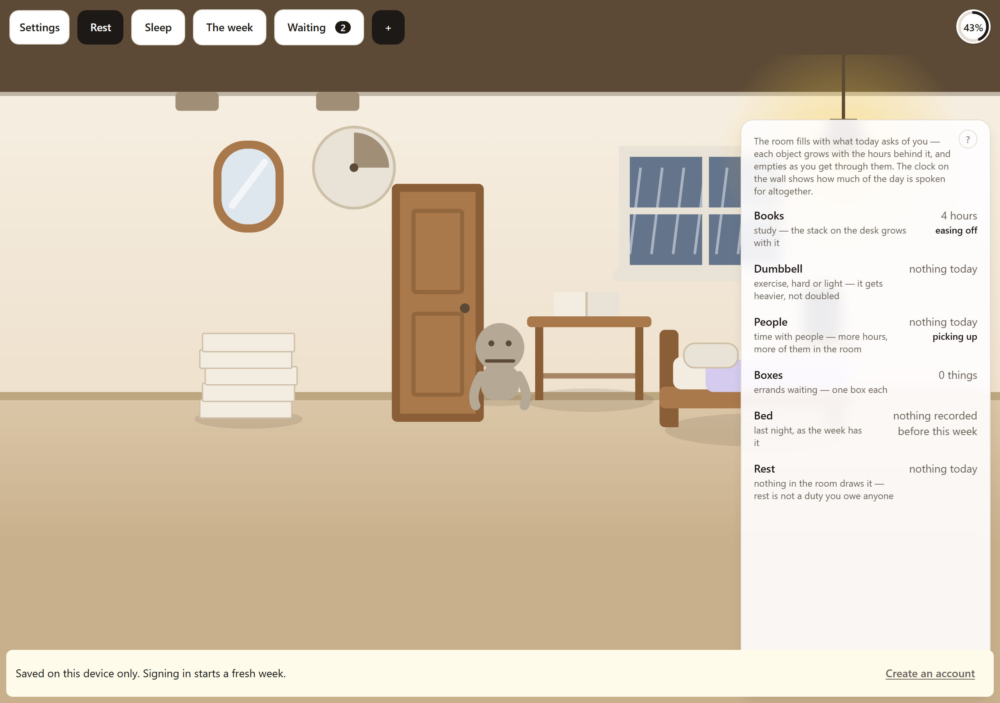
*The room with the dial in the corner. Nothing needs tapping to read it: the ceiling presses
lower as total load rises, the clutter is one box per pending errand, the window is the projection
rendered literally, and the character's posture is the reserve state. Tap any object for the
numbers behind it.*

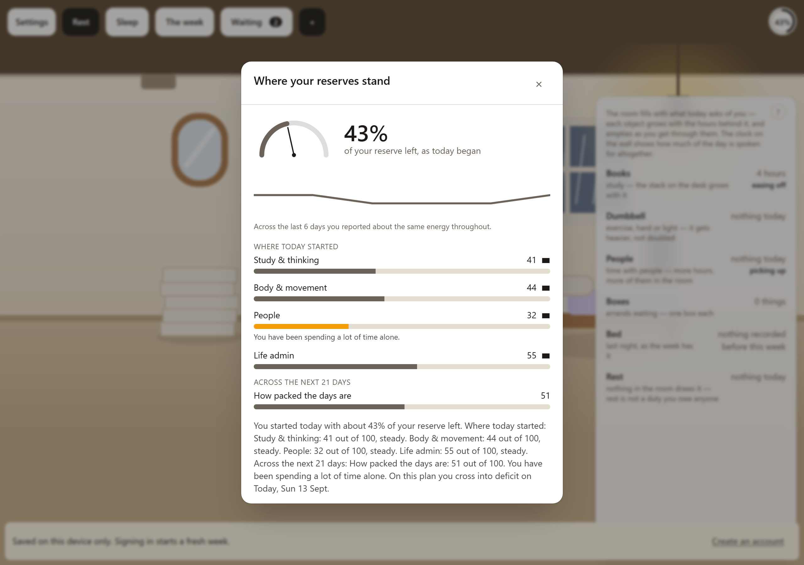
*Reserve remaining, said as what it is — "you have about 43% of your reserve left this week" —
with five domain bars each against its own ceiling and a ▲▬▼ trend glyph, so nothing depends on
colour.*

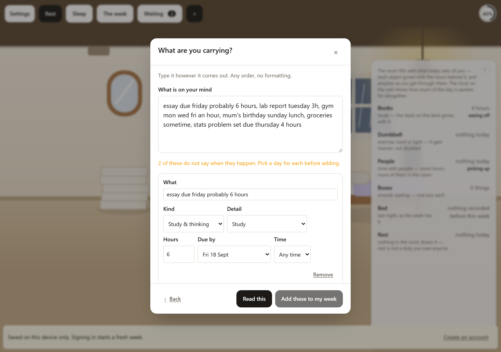
*One box, no formatting. An unpunctuated brain dump comes back as chips carrying a load type, an
effort estimate and a deadline where one was implied. Low-confidence rows are flagged, and nothing
enters the model until the student confirms.*

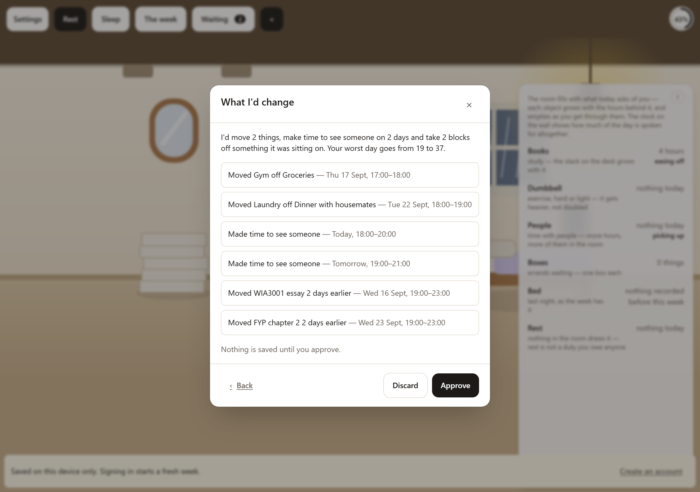
*Never "optimised." Always specific: what moved, what was batched, what rest was inserted, and what
the worst day goes from and to — with the room shown as* now *and* if you accept. *One tap undoes
all of it.*

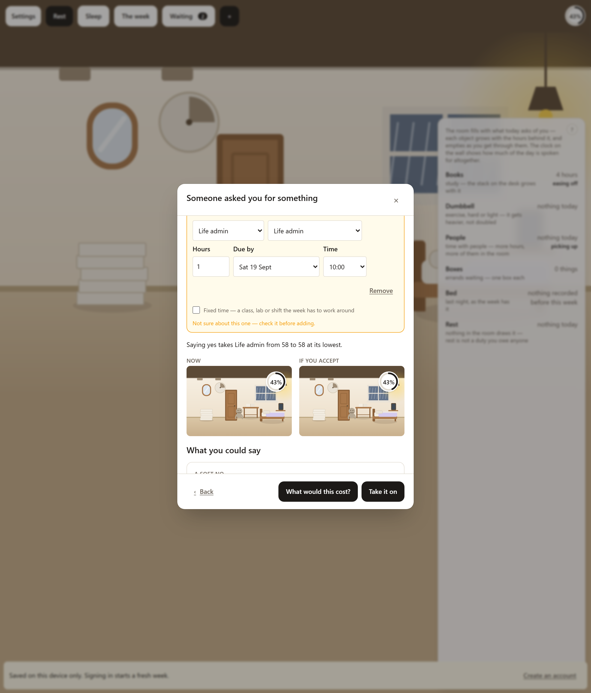
*An incoming ask, priced in what gets given up rather than in hours, with a drafted reply in three
tones. The app does the work of declining; the student keeps the decision and sends it themselves.*

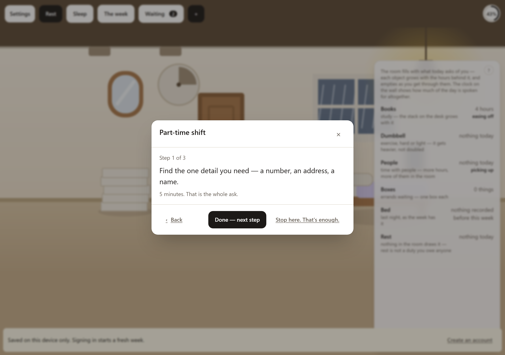
*One step, under ten minutes, and the next one only appears when this one is ticked. A stuck person
cannot choose from a menu, and a wall of unticked boxes reads as proof of how much is left.*

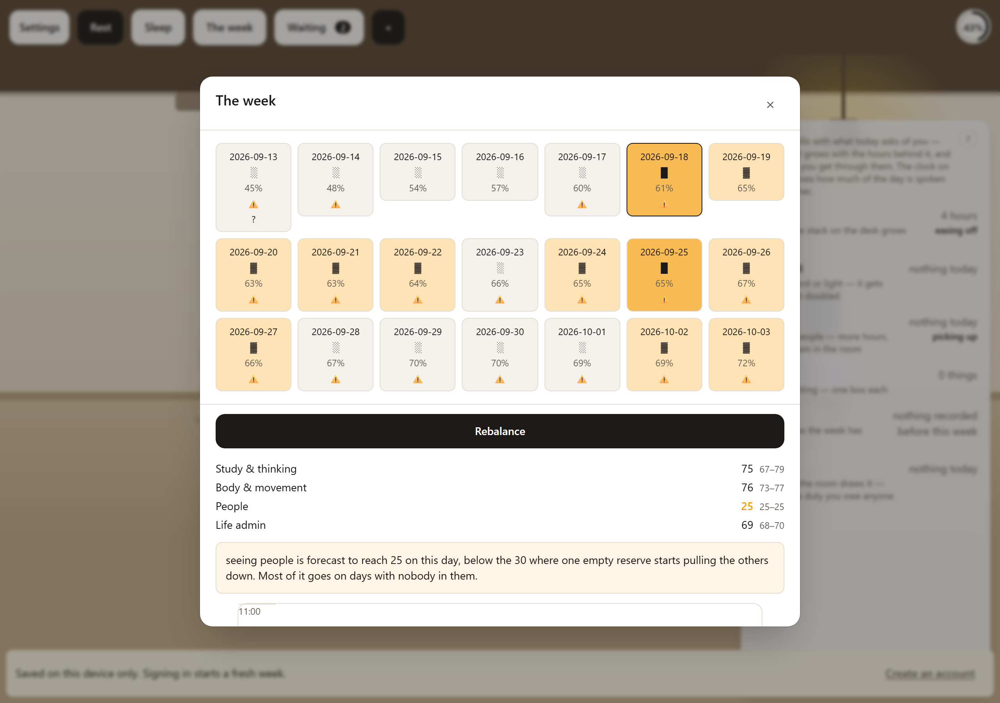
*The fortnight as a grid, with protected rest drawn as a real block the solver may not touch, and
the night band showing what each day is about to cost the night that follows it.*

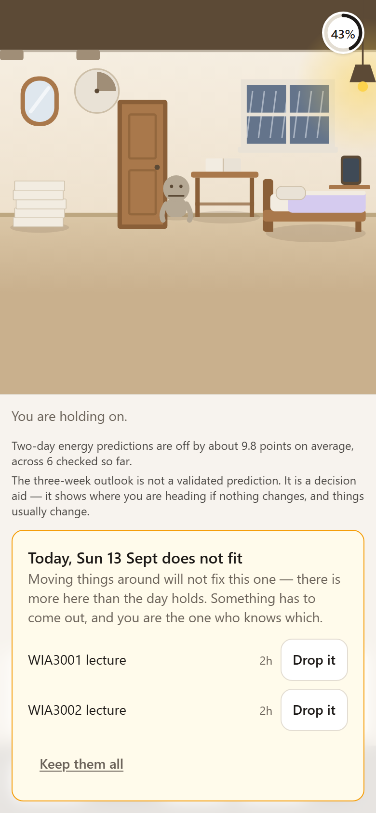
*Below a reserve threshold the whole interface collapses to one number and one action. A student at
12% reserve should not be handed a dashboard — this is a product decision as much as an
accessibility one.*

---

## 4. What Makes It Different

1. **Recovery efficiency falls with the reserve.** `efficiency = 0.45 + 0.55 × (reserve / 100)` —
   at a full reserve you get all of your rest back; at 20% reserve you get 56% of it. This single
   non-linearity is what a linear tracker structurally cannot express, and it is why a week can
   look fine on Tuesday and be unrecoverable by Thursday. Everything else exists to make that
   visible early enough to act on.

2. **It forecasts. Every comparable tool reports.** The engine produces a reserve for every one
   of the next 21 days, so the app can name the day a week breaks and act while there is still
   room to act. A planner tells you what you agreed to; a wellbeing app tells you how you felt.
   Neither will tell you that next Thursday is the problem — which is the question a student
   carrying too much is actually asking.

3. **The model learns your real durations from what actually happened.** A student schedules two
   hours for an assignment and it takes ten. Almost every planner treats that as the student
   failing to be realistic; here it is the most valuable data the app ever receives. Planned
   hours against actual hours are recorded on every completed block, and the overrun ratio is
   learned per kind of work *and* per family of task — "your essays run 1.8× over, your lab
   reports land on time" — then applied to the plan silently. The point is not the correction
   itself. It is that the app's estimate of what you can survive gets more honest the longer you
   use it, without ever asking you to try harder at estimating.

   Durations are one of three things it learns, and the other two are the same idea pointed at
   recovery rather than work: **how much a night is actually worth to this student**, and **where
   their own sleep stops paying back** — the top of §6.1's sleep window, learned down from the
   population figure of nine by comparing the two halves of that student's own nights. All three
   learners share one rule and one constant: say nothing until three attributable samples exist,
   because two points make a line out of a coincidence. Below that the app uses the population
   default and does not pretend otherwise. A student whose sleep never varies gets silence, by the
   same mechanism every other unmeasured parameter is silent — and `sleepBaselineHours`, the
   *bottom* of that window, is still unmeasured and is item 4 of the build plan rather than a
   quiet claim.

4. **Each reserve is priced and repaid on its own level — never the average of four.** Burnout is
   a floor problem. Averaging lets three healthy reserves subsidise a collapsed one, damping the
   spiral exactly where it matters. The headline number is an output and an input to nothing, and
   *every* screen tests the floor, so no screen can disagree with the model it renders.

5. **Low social load is flagged as a warning.** Almost every tracker counts it as healthy, because
   it sums hours. A student who is not busy but is isolated shows here as unwell — the cheapest
   available proof that the model understands burnout rather than arithmetic.

6. **The optimizer defends rest instead of filling it.** Auto-schedulers treat rest as the slack
   they can consume. Here protected rest is a hard constraint with exactly one door in the
   codebase, and nothing arriving from a language model may create it whatever the text says.

7. **A request is priced in what you give up, not in hours.** "Six hours" is a number nobody can
   act on. "Two gym sessions and one evening out, and your deficit crossing moves from day 21 to
   day 14" is a decision. The optimizer can say this because it just tried to fit the request and
   watched what got evicted.

8. **Provisional yes, with auto-expiry.** Every acceptance carries a review date. If the reserve
   cannot hold it by then, it lapses and the app drafts the withdrawal. Students do not struggle to
   say no because they lack a reason — they struggle because saying no requires an act. This
   inverts which direction the effort runs in.

9. **Micro-Start reveals one rung at a time.** Not a checklist. Ticking the current step is what
   makes the next one exist, so the student is never asked to choose and never shown how far they
   have left to go.

10. **Sequencing is a lever, not just placement.** Every finished activity leaves a residue on the
   reserves it was not about — hard exercise costs the next couple of hours of focus, a short walk
   adds to them. So the solver cannot stack gym at 5 and deep study at 7 and call it a good day. It
   also means that even when a timetable leaves the *days* fixed, the order within a day is still
   free, which keeps the optimizer useful for a student whose week is mostly locked.

11. **A language model may describe, but never originate.** Every model reply is parsed by a schema
   whose vocabulary comes from the engine's own types. A model may not invent an id, a day index,
   an hour, a load type or a block kind. Untrusted input does not become trusted by passing through
   a layer.

12. **We narrow our own claim.** The 21-day projection is a decision aid and the product copy says
    so. What we score and publish is the 48-hour energy prediction, because it resolves whether or
    not the student intervenes. A student decides what to drop based on what this says, so a number
    that is confidently wrong is worse than one the app admits it cannot compute.

---

## 5. Technical Architecture & Feasibility

### Tech stack

| Layer | Choice | Why | Constraint we expect |
|---|---|---|---|
| **Frontend** | React 19 + TypeScript on Vite, Tailwind 4 | Vite gives a sub-second reload loop, which matters more than anything else over a short build. TypeScript does real work here: the engine's own types are the vocabulary the AI schemas validate against. | React 19 is recent enough that some libraries lag. We avoided the problem by having almost no UI dependencies. |
| **Visuals** | Hand-rolled SVG + CSS transitions | The room and the dial are one design language, drawn directly. We deliberately did **not** add an animation library or a chart library — two design systems is a weekend gone. | Complex motion costs us more code than it would with a library. Accepted, since reduced-motion has to work anyway. |
| **App shell** | Installable PWA, own service worker, offline shell | Installs from a URL during judging — no store, no signing, no cable. | No sensor access: sleep, steps and screen time sit in the phone and we cannot read them, so sleep is *stated and reported* rather than measured. Capacitor is the named migration path, same React codebase. |
| **Model** | Pure TypeScript (`src/engine`, `src/optimizer`) | No I/O, no clock and no randomness anywhere in the engine. That is what lets the optimizer call the projection thousands of times per solve, and what lets the entire model be tested without a single mock. | Everything impure has to be pushed outward — a discipline rather than a cost. |
| **Backend** | Vercel serverless functions (`api/`) | The expensive work is client-side by design, so what remains is a handful of short request/response jobs. A Vercel cron drives the daily pass. | Cold starts on a free tier, so the functions stay thin. Every credential in the product lives here and nowhere else. |
| **Database & auth** | Supabase (Postgres + auth, row-level security) | Free tier, and an auth flow we did not have to build. | Free-tier projects pause when idle — worth warming before judging. A client's claim about who it is is always re-verified server-side, never decoded and trusted. |
| **Language & vision** | Groq | Fast enough that a brain dump feels instant, and free-tier. Drives the planner, photo import, Micro-Start chains, decline drafting and cost framing. | **No server-side quota on the public AI endpoints yet** — they spend the budget unauthenticated, which the code states in place. It is the first thing we would fix. Every endpoint has a non-AI fallback: with no key the planner drops to a rule-based parser rather than breaking. |
| **Calendar** | Google Calendar OAuth (import + push) | A supplement, never the only path — most Malaysian students do not keep their timetable there, and depending on it risks an empty week and a hollow first impression. | Tokens are encrypted at rest, and the entry point disappears from the UI entirely rather than half-working when unconfigured. |
| **Chat channel** | Telegram Bot API | A bot is free, has no review process, and handles voice notes and forwarded photos natively — which is exactly how a roster actually arrives. A chat id is a claim, not an identity, so linking goes through a short-lived code shown in the app. | The app must stay fully usable with the bot switched off. It is a second door, never the only one. |
| **Hosting** | Vercel, and only Vercel | One platform for the PWA shell, the service worker and every server route. Supabase sits alongside as a managed service — a dependency, not a second place to deploy to. | — |

**The dependency order is one-way and enforced:** `engine → optimizer → domain → ui`. In
particular `src/optimizer` must never import `src/domain`, because `src/domain` imports the
optimizer.

```
                 ┌──────────────────────── the browser (installable PWA) ────────────────────────┐
  photo ──┐      │                                                                               │
  voice ──┼──► ui ──► domain ──► optimizer ──► engine   (pure: 4 coupled reserves, 21-day band)   │
  typing ─┘      │     │           solver, <100ms, no backend call                                │
                 │     └──► data ──► IndexedDB (local) ──┐                                        │
                 └──────────────────────────────────────-┼────────────────────────────────────────┘
                                                         ▼
  Telegram ──► api/telegram.ts ──┐               Supabase (Postgres + auth, RLS)
                                 ├──► api/ ── the only place a credential is ever read
  Vercel cron ──► api/daily.ts ──┘        plan · draft · read-photo · micro-start · insight
                                          google-connect · -disconnect · -events · -push
                                                       │
                                                       ▼
                                        Groq (language + vision) · Google Calendar
```

### How the engine works

Every screen in this app is a reading of one small simulation. It is worth stating in full,
because the design behind each button is downstream of it — Rebalance, Rest and Later are three
different questions asked of the same machine.

#### One day, in one equation

The engine steps the fortnight forward one day at a time. For each of the four reserves:

```
reserve[d+1][t] = clamp(
    reserve[d][t]
  − drain[d][t]
  + recovery[d][t] × efficiency(reserve[d][t]) × headroom(reserve[d][t])
)                                    then coupling, then clamped to 0…100
```

Three details in that line are doing most of the work.

**Efficiency is read from the start of the day, not the end.** That ordering *is* the spiral:
the worse today begins, the less tonight's rest gives back, so a bad week compounds instead of
levelling off. Computing it after the drain would soften exactly the effect the app exists to
show.

**It is read per reserve, from that reserve's own level** — not from the average of four. The
average version was subtly wrong in a way that mattered: it let three healthy reserves subsidise
a collapsed one, damping the spiral precisely where a real student's worst reserve is driving
it. It also acted as an undeclared second coupling channel at an implicit weight of ~0.25 per
reserve, four times larger than anything in the real coupling matrix below.

**The `clamp` is a backstop, not the mechanism.** `headroom` is what keeps a reserve from
overshooting, and the difference matters: a bare clamp silently absorbs the surplus, throwing
away the distinction between a week that barely covered its costs and one that covered them
three times over.

#### The three curves

| Curve | Formula | What it says |
|---|---|---|
| **Efficiency** | `0.45 + 0.55 × (reserve / 100)` | How well a depleted student *converts* rest. 100% at full, 56% at 20% reserve, floored at 45%. |
| **Headroom** | `min(1, (100 − reserve) / 30)` | How much room there is *to convert into*. Flat at 1 below 70, so it is silent across the entire depleted range and cannot soften the spiral — it only bites approaching full. |
| **State cost** | `1 + 1.111 × max(0, 70 − reserve)/100 − carryover`, clamped to 0.5–3 | How much more a task *costs* when you are spent. At 70 reserve two hours of study costs two hours; at 25 it costs closer to three. |

Efficiency and state cost are deliberate mirrors: **depleted people are less efficient in both
directions — rest gives back less, and work takes more.** Above 70 the state multiplier is
exactly 1, so the model never *rewards* being fresh; it only penalises being spent.

| | |
|---|---|
| 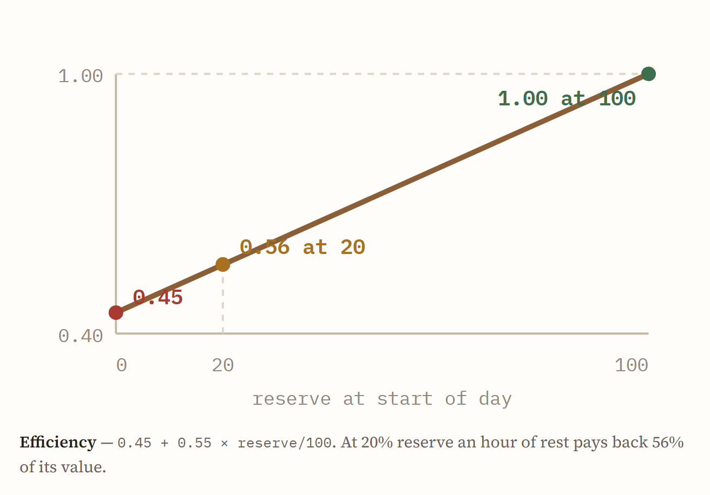 | 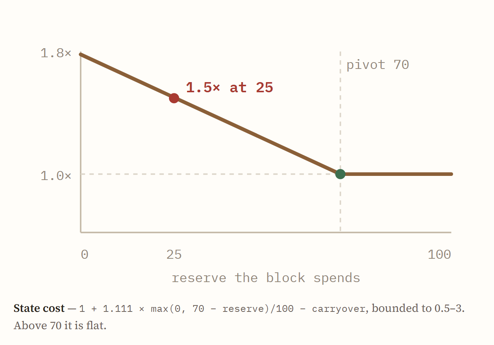 |

The two plots are the mirror stated as a picture. The left one slopes the whole way down: there
is no reserve at which rest is worth its full value again except a full one, and the floor at
0.45 means even a completely empty student gets *something* back — the spiral is steep, not
inescapable. The right one is flat until 70 and only then climbs, which is the asymmetry that
matters: being fresh buys you nothing, being spent costs you up to three times over.

Headroom exists because without it the model had no settling point. Recovery grew as a student
filled and drain grew as they depleted — both directions reinforcing — so the middle of the
range was a knife edge no week could rest on. With it, a given week converges on a reserve from
either direction, while a genuinely impossible fortnight still crashes. (A model where
*everything* settles would be the linear tracker we exist to reject.)

#### Carryover: the residue a finished block leaves

The `carryover` term in the state cost above is this table. Each finished activity leaves a
residue on every reserve, decaying exponentially from the moment it **ends** — something still
running has not left a residue, it is simply happening. It arrives as a delta on the multiplier:
negative makes the next block dearer, positive makes it cheaper.

| After this | Mental | Physical | Social | Errands | Half-life |
|---|---:|---:|---:|---:|---:|
| Study block | −0.30 | 0 | −0.05 | 0 | 2.5h |
| Hard exercise | −0.25 | −0.20 | 0 | −0.10 | 3h |
| Social, draining | −0.15 | 0 | +0.10 | 0 | 2h |
| Errands | −0.10 | −0.05 | 0 | +0.05 | 1.5h |
| Light exercise | +0.10 | +0.05 | +0.05 | 0 | 2h |
| Rest | +0.15 | +0.10 | 0 | 0 | 2h |
| Social, restorative | +0.10 | 0 | +0.20 | 0 | 2h |
| Sleep | 0 | 0 | 0 | 0 | 0h |

Sleep is the only row that is zero across the board, and its zero half-life says why: it is a
full reset rather than a trailing effect. The positive rows are what make the app's own advice
self-justifying — a walk is not merely rest, it measurably buys a better study block after it.
The negative rows are why the solver cannot stack gym at 5 and deep study at 7 and call it a good
day, and they are the reason sequencing is a lever at all.

Every figure here is a **population prior**, not a measured one. What is structural is the
direction of each sign; the magnitudes are meant to be calibrated per student and are not yet —
that is the learned cross-effect matrix on the roadmap, and §2.1 records why faking it would have
been dishonest.

#### Where drain comes from

Every term below is charged per day, per reserve.

| Source | How it is charged |
|---|---|
| **The work itself** | `hours × intensity × estimateBias × typeIntensity[t] × stateMultiplier` — where `typeIntensity` is mental 1.0, **physical 1.6**, social 0.6, errands 0.5. Physical is the most expensive hour in the table, because an hour of hard training is plainly not less depleting than an hour of reading. (Whether a missed gym session *matters* less is a different question, and it lives in the optimizer.) |
| **Secondary cost** | An hour of one kind of load also charges the other three. Sitting still and concentrating costs a body (mental → physical 0.15); errands cost a head and legs (0.1 and 0.2). Deliberately empty where carryover already prices the same effect — charging both would be one claim counted twice. |
| **Short sleep** | `max(0, 5 − sleep) × kSleepDebt`, at 4 points per hour short for mental and physical. Charged as **drain, not negative recovery** — because recovery is multiplied by efficiency, so a negative credit would *shrink* as a student got more depleted, meaning deprivation would hurt a rested student more than an exhausted one. Backwards. |
| **Fragmentation** | `(blocks − 1) × 1.5` on mental. A scattered day drains more than a blocked day at equal hours. |
| **Deadline proximity** | `6 / (1 + days_to_nearest)` on mental. Anticipatory stress is real, and it rises hyperbolically as the date closes. |
| **Travel** | `venue_changes × 1.5` on errands. |
| **Isolation** | `1.5 × load_scale × shortfall` on social, where shortfall is how far under half an hour of contact the day fell, and load_scale rises with how busy the day was (capped at 2×). A busy day alone is lonelier than a quiet day alone. |

#### Where recovery comes from

```
recovery[d][t] = sleepCredit × kSleep[t] + restHours × kRest[t]     (+ contact, social only)
sleepCredit    = max(0, min(sleep, 9) − 5)
```

Sleep pays inside a **window, not a floor**. Below 5 hours it credits nothing and costs through
the drain term above; above 9 it stops paying, because otherwise twelve hours was credited as
seven hours of recovery and "enough" was not something the model could hold. The upper end of
that window is *learned per student* where their own nights vary enough to measure it; the lower
end is still the population figure, and the README's build plan says so.

Rest is capped at **3 useful hours per block** — per block, not per day, so three separate hours
still pay three hours' worth. It is the single unbroken twelve-hour block that is suspect. A
12-hour scroll session is not recovery and the model must not score it as neutral free time.

#### How each bar moves — and what it will refuse to respond to

This is the part worth reading closely, because each bar's *deafness* is as deliberate as its
sensitivity.

| Bar | Falls with | Rises with | Deliberately will **not** respond to |
|---|---|---|---|
| **Mental** | Study and writing (1.0/hr), fragmentation, deadline pressure, short nights (4/hr short), plus residue from exercise and errands | Sleep (**6**/hr credited — the largest single term in the model) and rest (4/hr) | — |
| **Physical** | Exercise (1.6/hr, the dearest hour there is), short nights, sitting still for long stretches | Sleep (3/hr) and rest (3/hr) | — |
| **Social** | Isolation, every single day, scaled up by how busy that day was | **Contact, and nothing else** (4/hr of restorative social time) | **Sleep — in either direction.** `kSleep.social` and `kSleepDebt.social` are both hard zero. This is the most load-bearing zero in the codebase: a non-zero value took an isolated student from 20 to 65 over a fortnight of seeing nobody, which makes the app's answer to loneliness "have an early night" and erases the isolation signal the engine exists to surface. |
| **Errands** | Life admin (0.5/hr, the cheapest), travel between venues | Sleep (2/hr), rest (2/hr) | **Short sleep.** `kSleepDebt.errands` is zero — not rounded down, but absent, because there is no evidence behind a figure there and an invented one would be a claim the model cannot support. |

Then **coupling** runs, after every tick: a deficit in one reserve drags the others down. The
matrix is small and one-directional by construction — every entry is non-negative and applied as
a subtraction, so coupling can only ever drag a reserve *down*, never lift one. The two entries
that matter most are **physical → mental at 0.12** (a wrecked body drags the mind hardest) and
**social → mental at 0.08**. The diagonal is zero: a reserve must not compound its own deficit.

The consequence is the one we most want a judge to notice: **a student who is not busy but is
isolated shows here as unwell.** A single-number model calls them healthy.

Finally, two numbers are read off the four bars and they are not interchangeable:

- **`overallReserve`** — the equal-weighted mean. This is the dial's headline, and it is an
  input to *nothing*. It used to feed both the efficiency curve and the state cost, which meant
  a student with mental at 0 and everything else at 80 recovered and paid as though they were at
  60.
- **`floorReserve`** — the lowest of the four. This is what the deficit crossing, the week grid,
  the room's weather and the optimizer's objective are all measured against. **"Deficit" means
  the floor, everywhere** — the mean is strictly laxer, and one screen using it would be one
  screen disagreeing with the model it renders.

#### What Rebalance actually optimises

```
score = worstFloor
      − 0.3   × deficitDays          (days with any reserve under 30)
      − w_f   × fragmentation        (block count, weighted by inferred week mode)
      − w_a   × deficitArea          (how far under 30, summed)
      − 0.008 × deadlinePressure
      − 0.005 × neglectPressure
      − 0.01  × dailyLoad            (square of whole hours past a 7-hour day)
      − 0.01  × nightHours
```

`worstFloor` is the headline term and every other term is sized as a tiebreaker that can never
outrank it, because **burnout is a floor problem**: a fortnight that averages fine and bottoms
out at 8 is still a crash. The rest of the terms each exist because of a specific measured
failure:

- **`deficitArea`**, because `min()` *saturates*. Once a student has bottomed out, every
  candidate schedule scores an identical zero and the search has no gradient left — at exactly
  the moment it matters most. Without this, the app tells the person who most needs an answer
  that their worst day goes "from 0 to 0".
- **`deadlinePressure` and `neglectPressure`**, because without them deferring work was free,
  and undated work — health, rest, seeing people — always lost.
- **The daily-load penalty**, because the objective was silent about how full a single day is.
  Measured on a real fortnight: moving three hours off a nine-hour day onto a one-hour day
  changed the score by **0.0000**. The solver was not declining to level the week; it could not
  see the difference.

**The search** is hill climbing — best neighbour, to convergence or 200 iterations, no solver
library and no backend call. Neighbours move one movable task one day, batch
two same-type errands, insert a rest block into a gap, insert restorative social contact (without
this move the solver could watch the social reserve fall to zero with nothing in its vocabulary
to do about it), or reorder within a day.

**§2.1's three random restarts are gone, and that is a measurement rather than a shortcut.** As
written they were three *identical* climbs: all three began from the same schedule, and the seed
only rotates the scan order while best-neighbour selection picks the same maximum regardless.
Five different seeds produced byte-identical results. Making them genuinely random would mean
perturbing the starting week, which measured at 5.5× the evaluations for 0.31 of a point — so the
loop was removed and the output is unchanged. The `Rng` stays, because the scan order is still
what breaks ties.

**The 100ms budget in §2.1 is not met, and the code says so where it is measured rather than
here.** `npm run measure:solve` reports 264ms on an ordinary fortnight and 164ms on a crunch
week, against a target of under 100ms — down from 3131ms, and the remaining gap needs incremental
scoring rather than another constant. It is still client-side and still fast enough that the
preview appears without a spinner, which is the property the budget was protecting; it is simply
not the number §2.1 asked for.

**Hard constraints:** nothing past its deadline, nothing overlapping a fixed block, a daily hours
cap so it cannot solve your week with a 14-hour Sunday, and **protected rest never moves**. One
further rule was added after measurement: **no neighbour may touch a day already behind the
student.** The neighbourhood originally had no notion of "today", so the cheapest improvement
available was always to insert recovery into days already lived — the engine re-projects from
day zero, so retroactive rest lifts the whole fortnight including the trough `min()` reads. On a
real account with today at day 7, all five blocks the solver added landed in the past, and it
reported "your worst day goes from 29 to 62" where leaving the past alone gave 29 to 30.

#### Three buttons, one machine

Rebalance, Rest and Later are the same engine asked three different questions, and none of them
applies anything on its own — each computes an offer the student approves, because a week that
changes behind somebody's back is one they lose their grip on.

| Button | The question | How it is answered |
|---|---|---|
| **Rebalance** | "Fix the fortnight." | Thousands of projections, hill-climbing the score above. |
| **Rest** | "I am flat *now*." | Three rungs on today only; ~a handful of projections. Refuses rather than offering a future day. |
| **Later** | "Not this, not today." | Scores each day that has room with the *rebalancer's own* objective — about twenty projections, not thousands. Deliberately not a second optimizer, so no second set of weights can drift out of step with the first. |

One measurement decided the shape of all three. Before any rebalance UI existed we loaded a real
UM timetable plus a realistic assignment set and counted the solver's degrees of freedom, because
if rebalance could only ever return "moved one thing by a day", then smallest-fix, within-day
reordering and rest insertion would have to carry this promise instead. That is what
`npm run measure:dof` still reports, and it is why within-day sequencing is in the model at all:
a timetable can fix your *days*, but it almost never fixes the *order* within them.

### Build plan & scope

**Already built and passing.** `npx tsc --noEmit` is clean, and the unit suite is green: 3,191
tests across 221 files, in about 145 seconds. Coverage thresholds are enforced in CI at 97%
statements, 93% branches, 97% functions and 98% lines across `src`, and the suite currently sits
just above each of them (97.2 / 93.1 / 97.3 / 98.5). Those numbers describe `src` only — `api/` is
outside the gate, which is item 3 below. Every behaviour change ships with its tests in the same
commit — a green build on stale tests only proves the code still does what it used to.

- The engine and the optimizer, with a measured solve budget (`npm run measure:solve`) and a
  measured degrees-of-freedom check (`npm run measure:dof`) run in week one — before any rebalance
  UI existed — to confirm the solver actually has something it can move on a real UM timetable.
- The room, the week grid, the today panel, the dial, the say-anything planner, photo import,
  Google Calendar import and push, Micro-Start, the Rest button, the request box, the sleep page,
  low-energy mode, accounts, and the Telegram channel.

**What we plan to build during the building phase**, kept deliberately narrow:

1. **Refine the front end.** Three things, in order of how much they cost a first-time reader.
   `RoomShell.tsx` is 1,824 lines against the 800-line ceiling we hold ourselves to, and the
   settings sheet is the piece that should come out of it — a known, scoped debt rather than a
   discovery. Then the empty-room problem: on a fresh week the room is nearly bare, which is the
   worst possible first impression for an app whose whole argument is *look at how much you are
   carrying*. Then the phone, at 390px, since that is the device this is actually used on and
   every screen has to survive it.

2. **Make the state cost personal.** Recovery is already learned three ways — durations, the
   recovery coefficients, and where sleep stops paying — but the other half of the mirror is not.
   `STATE_COST_PIVOT` (70) and `STATE_COST_SLOPE` (1.111) are global constants for everyone, so
   the model currently claims every student starts working slower at exactly the same reserve.
   Some people hold form until they are nearly empty and some lose an hour's worth of focus at 60.
   The evidence is already being collected: §8.1's resolved predictions plus planned-against-actual
   durations at known reserve levels. The discipline is the one Ruling 69 sets — a pivot is a
   threshold, and a threshold cannot be learned by nudging it, so this needs its own estimator and
   its own honest silence until the evidence clears the bar, not a fifth row in
   `recoveryLearning`.

3. **Refine the engine.** Measure what is still guessed, starting with `sleepBaselineHours` —
   where sleep *starts* paying back, the parameter the three-day painter was meant to extract, and
   the last population figure in the sleep window. Then rolling debt, so deferred load compounds
   rather than quietly disappearing. Then the solve: `npm run measure:solve` reports 264ms against
   §2.1's 100ms budget, and closing that needs incremental scoring rather than another constant.
   The carryover and coupling matrices stay priors for now, and stay labelled as priors.

4. **Events whose duration nobody knows.** Today every item must carry hours, and when the student
   does not say, `fallbackParser` quietly substitutes `DEFAULT_EFFORT_HOURS` — one hour, presented
   on screen exactly like a figure the student stated. That is the app inventing a number and then
   forecasting from it, which is the failure §8.2 exists to prevent. The fix has three parts:
   carry *unstated* as a real state rather than collapsing it to a default; fill it from what the
   student's own history says a task of that family actually takes, which `realityCheck` already
   measures per kind and per family; and show it as an assumption the student can correct rather
   than a fact they appear to have entered. Where there is no history yet, the honest answer is a
   visible question, not a confident one.

5. **Name what is actually causing the overload.** `domain/deficitCause` already does most of
   this: for any deficit day it recomputes the drain exactly as it was charged, names the one
   reserve that gave way, finds the run-up back to where that reserve was last healthy, and lists
   where the points went, biggest first, in the student's own words. What it cannot yet answer is
   the question a student actually asks, which is about a *thing* and not a day: **what does this
   commitment cost me across the fortnight?** That is a counterfactual — re-project with the item
   removed and report what the floor does — and it is worth building because it is measured rather
   than argued, and because it is the input item 6 needs.

6. **What an event is worth, and what comes out when the week will not fit.** The app already
   knows what things *cost*; it has never had a view on what they are *for*. Two decisions bound
   how this can be built. Ruling 20: no student is asked to rank their own work, because everybody
   marks everything high and the ranking carries no information once they have — so `CONSEQUENCE`
   is derived from what the app already knows, load type × hours. And `domain/overfull` states
   that inventing an importance ranking out of the fields on a block "would be exactly the
   confidently wrong number this project holds to be worse than an admitted gap." So this is built
   as **ordering, never as deletion**: extend the derived value with deadline proximity, whether
   the thing is fixed, and item 5's counterfactual, and use it to *sort* the candidates the
   overfull card already shows — cheapest relief and least consequence first. The card keeps
   saying which day is the problem and what is standing on it. The student still decides what
   comes out, and nothing is ever dropped automatically.

7. **Server-side quota and auth on the public AI endpoints.** The one honest hole in the current
   build: `plan`, `draft`, `read-photo`, `micro-start` and `insight` are unauthenticated. Highest
   priority, because it is the only thing here that can cost real money.
8. **Bring `api/` inside the coverage gate.** Those endpoints hold every credential in the product
   and currently sit outside the numbers CI enforces. The fix is covering their pure parts the way
   the Telegram endpoint already is — not widening the gate.
9. **Extract the settings sheet out of `RoomShell.tsx`.** It has grown past the file-size ceiling
   we hold ourselves to — a known, scoped debt rather than a discovery. (The front-end entry above
   carries this; it is named separately because it is the one piece of that work already scoped.)
10. **Measure where sleep *starts* paying back** (`sleepBaselineHours`), the parameter the
    three-day painter was meant to extract. Half of a student's personal sleep need is already
    learned; this is the other half.
11. **Rolling debt** — deferred load compounding rather than quietly disappearing.
12. **The Malaysia layer, smallest-first:** a hardcoded public-holiday table (a holiday reduces
    commitments but not deadlines, so it shifts load rather than removing it), and festival periods
    defaulting to *demanding* rather than restful, which for most students is the truth.

13. **Make the insight block smarter without giving it authority.** The model on the Reserves
    sheet is a rephraser: `domain/reserveInsight` computes every number and the one action first,
    and `ai/insightSchema` refuses the whole reply if the line count changed — a line added has
    invented a claim, a line dropped has deleted a warning. That boundary is §8.2 in force and is
    not what needs loosening. What needs doing is making it observable (`npm run dev` has no
    `/api` proxy, so the call 404s and nobody has ever read the model's actual output), then
    passing structured facts rather than prose so it can lead with what matters — under a rule as
    mechanical as the count check. When a line reads wrongly the fault is upstream, in
    `domain/reserveInsight`, not in a prompt.

14. **Make the same activity reuse the same name** ([#71](https://github.com/DennisHengShuYi/Codenection/issues/71)).
    §2.4's ladder groups answers by title, so the name is the key the learning is stored under: a
    student who writes `badminton`, `Badminton`, `badminton w sam` and `bball` has four buckets,
    none of which reaches the three answers Reality Check needs, and the app falls back to a number
    about their whole area of life. Two halves. The matcher is containment over normalised words
    (`domain/taskKey`), which handles `essay` / `WIA3001 essay` and not typos, short forms or
    synonyms — and must stay conservative at the boundary, because merging `Run` with `Run errands`
    would teach the app that a walk takes as long as a supermarket trip. The other half is cheaper
    and larger: `snapTitle` runs in `parseBrainDump` alone, so photo import, the request box and
    the calendar never snap at all — and a calendar import brings in a fortnight at once, every row
    named whatever its owner called it. Every way in offers the names already in use; only one of
    them uses them.

**Explicitly not in scope**, and on the roadmap slide instead: the learned per-user cross-effect
matrix (it needs weeks of ratings and cannot be honestly demonstrated in a weekend), status
broadcast, hangout matching, the cohort curve, Ramadan mode, and the Capacitor migration for
sensors and a true home-screen widget.

---

## Running it

```bash
npm install
cp .env.example .env     # documents every variable and what stops working without it
npm run dev              # http://127.0.0.1:5180
```

| What | Command |
|---|---|
| Tests | `npm test` |
| Typecheck | `npx tsc --noEmit` |
| Coverage | `npm run test:coverage` |
| Browser suite | `npm run test:e2e` |
| Solver timing | `npm run measure:solve` |
| Build | `npm run build` |

Two failure modes look like bugs in your own code rather than missing configuration: without
`GROQ_API_KEY` the planner silently falls back to its rule-based parser, and without all four
`GOOGLE_*` values the calendar entry point disappears from the UI entirely.
